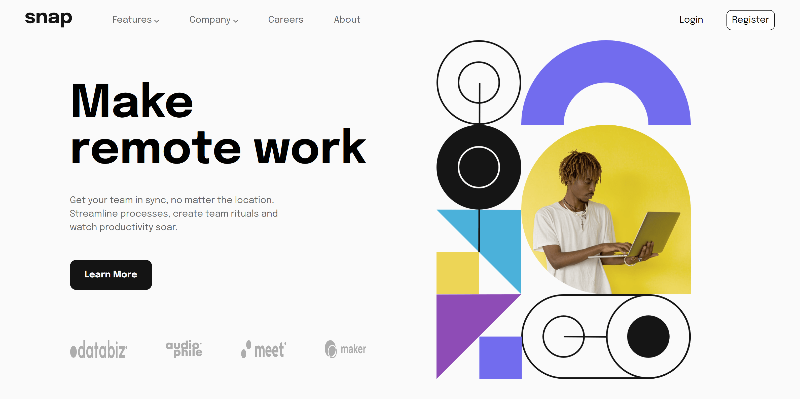
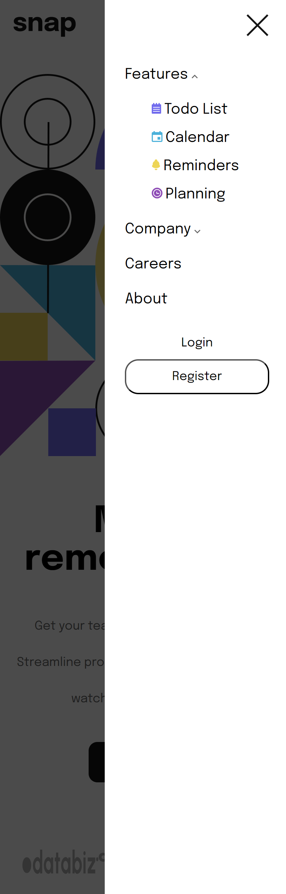

## Table of contents

- [Overview](#overview)
  - [The challenge](#the-challenge)
  - [Screenshot](#screenshot)
  - [Links](#links)
- [My process](#my-process)
  - [Built with](#built-with)
  - [What I learned](#what-i-learned)

**Note: Delete this note and update the table of contents based on what sections you keep.**

## Overview

### The challenge

Users should be able to:

- View the relevant dropdown menus on desktop and mobile when interacting with the navigation links
- View the optimal layout for the content depending on their device's screen size
- See hover states for all interactive elements on the page

### Screenshot

.png)

### Links

- Solution URL: [Add solution URL here](https://github.com/notZairus/FrontendMentor_IntroSectionWithDropdownMenu)
- Live Site URL: [Add live site URL here](https://notzairus.github.io/FrontendMentor_IntroSectionWithDropdownMenu/)

## My process

### Built with

- HTML5 markup
- CSS custom properties
- Flexbox
- Javascript

**Note: These are just examples. Delete this note and replace the list above with your own choices**

### What I learned

I learned how to make a sidebar.
